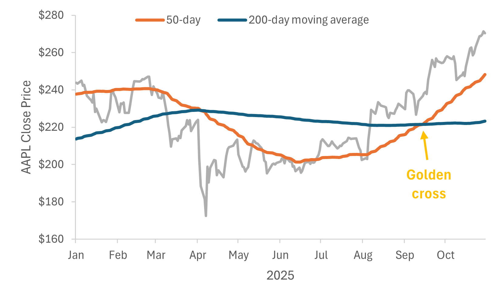

<H1>OBJECTIVE</H1>
<H3>The dataset for this drill contains daily closing prices for the SPDR S&P 500 ETF Trust (SPY) over the last 5 years.

  The task is to calculate the 50-day and 200-day moving averages based on the closing price, and identify every “Golden Cross” moment – when the short-term average (50-day) crosses from below to above the long-term average (200-day) – signaling a potential bull market</H3>

To complete the drill,I created a table containing the date, close price, and three new columns:

50-day moving average: The average closing price for the last 50 trading days, calculated for each date

200-day moving average: The average closing price for the last 200 trading days, calculated for each date

Golden Cross: A binary field (1/0) that equals 1 only on the exact date when the 50-day average crosses from below the 200-day average; otherwise 0 
